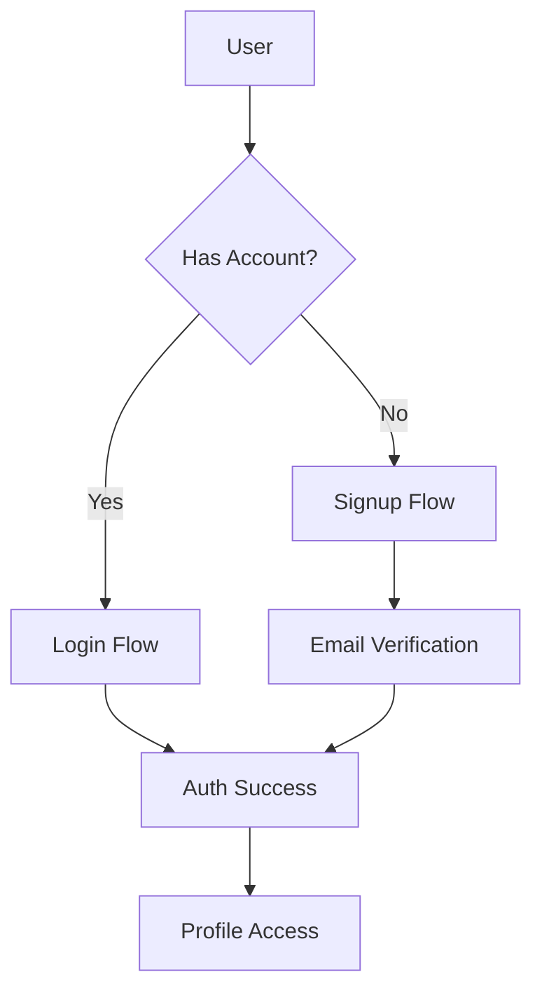

# Auth & Profile System Implementation Guide

## Overview
This guide outlines the implementation of our authentication and profile system, including signup flow, database integration, and profile management.

## System Components

### 1. Authentication Flow


### 2. Database Schema
```prisma
model User {
  id              String    @id @default(cuid())
  email           String    @unique
  password        String    // Hashed
  userType        UserType
  emailVerified   Boolean   @default(false)
  verifyToken     String?
  lastLogin       DateTime?
  // Profile fields...
}
```

## Implementation Phases

### Phase 1: Signup Flow
- **Frontend Components:**
  - SignupPage
  - EmailVerification
  - UserTypeSelection
  - BasicProfileSetup

- **Backend Endpoints:**
  - POST `/api/auth/signup`
  - POST `/api/auth/verify-email`
  - GET `/api/auth/resend-verification`

- **Security Measures:**
  - Password strength validation
  - Email verification
  - Rate limiting
  - Input sanitization

### Phase 2: Database Integration
- **Core Features:**
  - User persistence
  - Profile data storage
  - Session management
  - Token handling

- **Security Layer:**
  - Password hashing (bcrypt)
  - JWT implementation
  - Session validation
  - CSRF protection

### Phase 3: Profile System
- **Components:**
  - Profile editing
  - Image upload
  - GitHub integration
  - Settings management

- **Data Flow:**
  - Profile updates
  - GitHub sync
  - Image processing
  - Validation

## API Endpoints

### Authentication
```typescript
// Signup
POST /api/auth/signup
Body: {
  email: string
  password: string
  userType: UserType
  displayName: string
}

// Login
POST /api/auth/login
Body: {
  email: string
  password: string
}

// Verify Email
POST /api/auth/verify-email
Body: {
  token: string
}
```

### Profile Management
```typescript
// Get Profile
GET /api/profile/:userId

// Update Profile
PUT /api/profile/update
Body: ProfileUpdateDTO

// Sync GitHub
POST /api/profile/github/sync
Body: {
  githubUsername: string
}
```

## Security Considerations

### 1. Password Security
- Minimum length: 8 characters
- Required complexity:
  - Uppercase letters
  - Lowercase letters
  - Numbers
  - Special characters
- Bcrypt hashing with salt

### 2. Token Management
- JWT structure
- Token expiration
- Refresh token rotation
- Secure storage

### 3. API Security
- Rate limiting
- Input validation
- Error handling
- Logging strategy

## Testing Strategy

### 1. Unit Tests
- Auth service functions
- Profile update logic
- Validation functions

### 2. Integration Tests
- Signup flow
- Login process
- Profile updates
- GitHub sync

### 3. E2E Tests
- Complete user journeys
- Error scenarios
- Edge cases

## Implementation Timeline

### Week 1: Basic Auth
- [ ] Setup Prisma schema
- [ ] Create auth endpoints
- [ ] Implement password hashing
- [ ] Setup JWT

### Week 2: Signup Flow
- [ ] Create SignupPage
- [ ] Add form validation
- [ ] Setup email verification
- [ ] Implement GitHub OAuth

### Week 3: Profile System
- [ ] Update ProfilePage
- [ ] Add real data integration
- [ ] Implement image upload
- [ ] Add GitHub sync

### Week 4: Polish & Security
- [ ] Add loading states
- [ ] Implement error handling
- [ ] Add validation
- [ ] Security measures

## Error Handling

### HTTP Status Codes
- 200: Success
- 201: Created
- 400: Bad Request
- 401: Unauthorized
- 403: Forbidden
- 404: Not Found
- 422: Validation Error
- 429: Too Many Requests
- 500: Server Error

### Error Response Format
```typescript
interface ErrorResponse {
  status: number
  message: string
  errors?: {
    field: string
    message: string
  }[]
}
```

## Development Guidelines

### 1. Code Organization
- Separate concerns (auth, profile, common)
- Use TypeScript interfaces
- Follow naming conventions
- Document complex logic

### 2. State Management
- Use React Context for auth state
- Implement proper loading states
- Handle errors gracefully
- Cache profile data

### 3. Performance
- Implement lazy loading
- Optimize image uploads
- Use proper indexing
- Cache where appropriate

## Deployment Considerations

### 1. Environment Setup
- Configure env variables
- Setup email service
- Configure storage
- Setup monitoring

### 2. Database Migration
- Create migration scripts
- Plan rollback strategy
- Test migrations
- Backup strategy

### 3. Monitoring
- Error tracking
- Performance metrics
- User analytics
- Security alerts

## Resources

### Documentation
- [Prisma Docs](https://www.prisma.io/docs)
- [JWT Best Practices](https://auth0.com/blog/jwt-handbook)
- [React Security](https://reactjs.org/docs/security.html)

### Tools
- Prisma Studio
- JWT Debugger
- Postman Collections
- Testing Libraries 